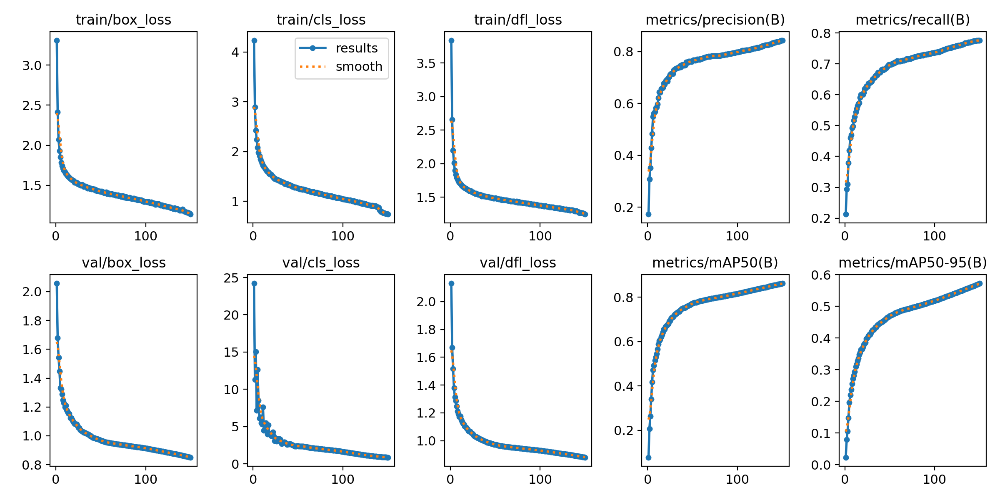
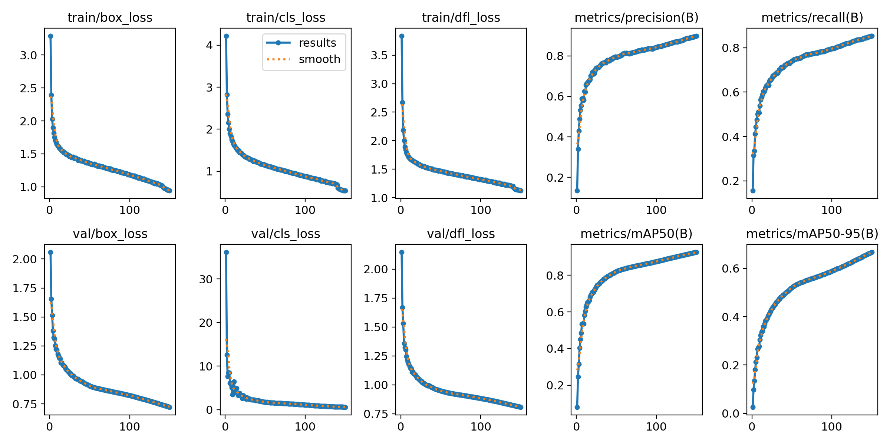
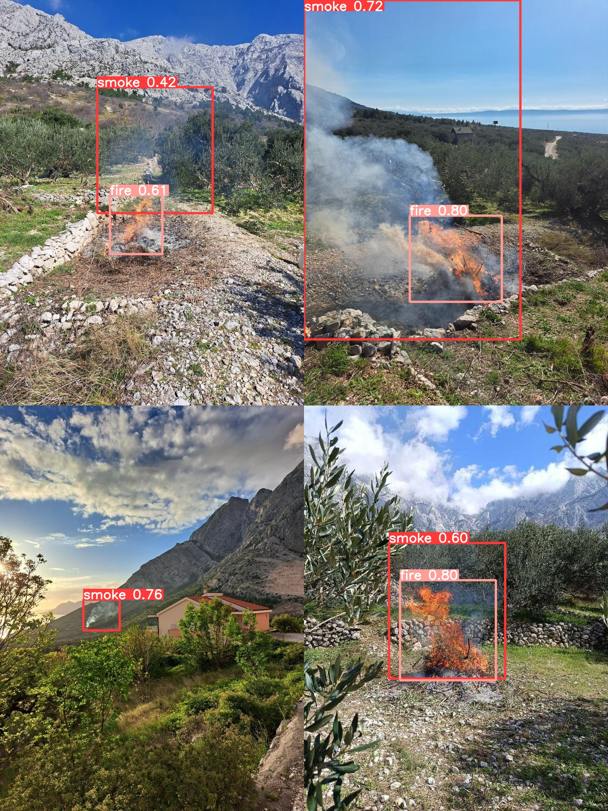
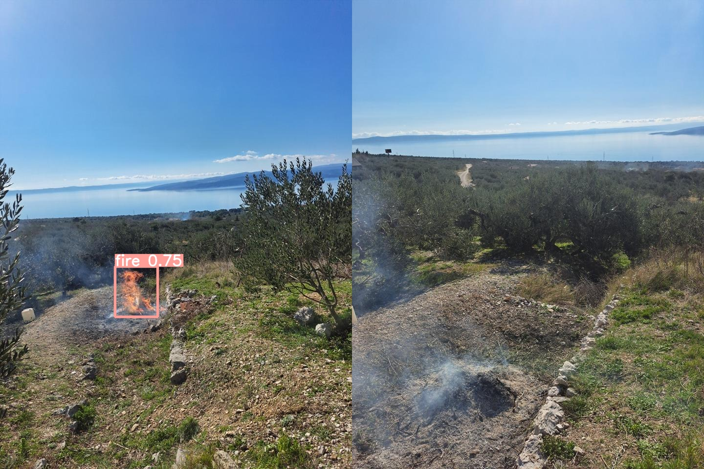
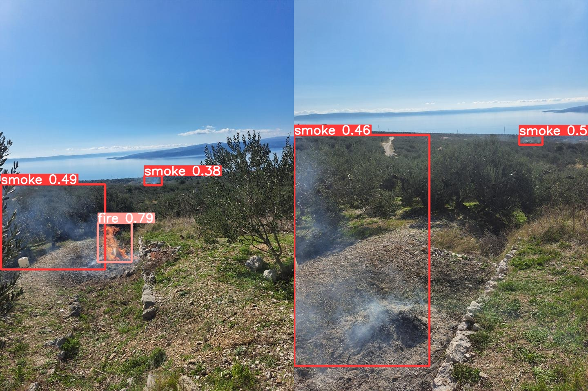
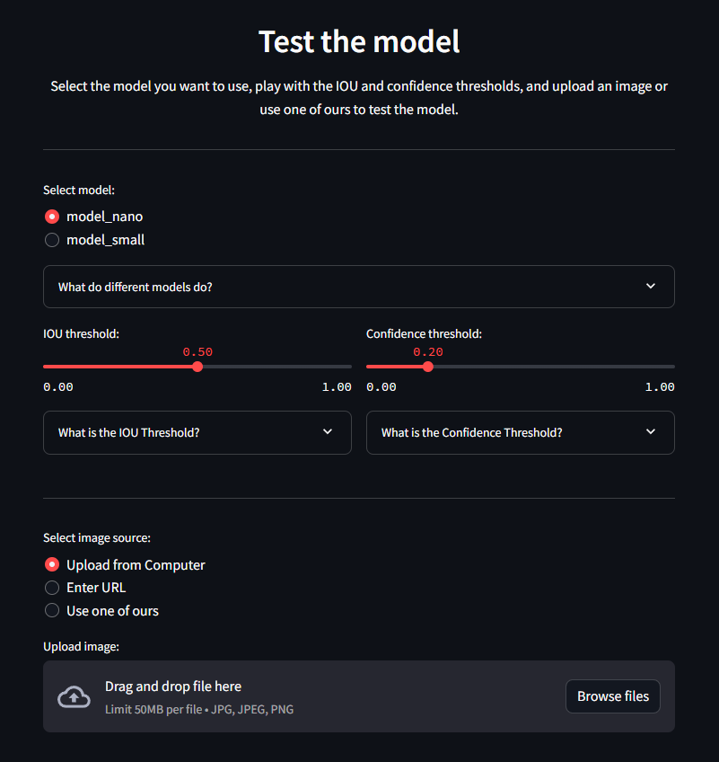

# Fire and Smoke Detection
Training YOLOv8 models for fire and smoke detection from scrach on DFire dataset and custom data specific for Mediteeranian olive groves. 
Deployment and testing of trained model using Streamlit.

## Motivation
In the recent years, Mediteeranian countries deal with a lot of wildfires, some of which origionating from mishandling of dry leaves and branches left in olive groves.
Usually found far from urban infrastructure, it is hard to iminently detect early staged fires in such areas which delays the response time from authorities and lowers the possibility of a positive outcome.
Thats where object detection models trained on terrain specific data come to play and together with basic monitoring infrastructure may provide high level of early fire and smoke detection which could in turn increase the odds for fast and effective response.

## Training
Trained models based on YOLOv8n and YOLOv8s with planes to train some heavier models as well. Used a DFire dataset for baseline training as well as my Croatia_fire_dataset for terrain specific training. <br>
### Training structure
```yaml
data
  - images
      - train
      - test
  - labels
      - train
      - test
```

### Training results
Both models were trained for 150 epochs using Cuda on Nvidia RTX 3070Ti

<div style="display: grid; grid-template-columns: 1fr 1fr; gap: 0;">
    
    

As can be seen on training metrics both models improved well during the training both in reducing loss and increasing the precision. 
YOLOv8 small model shows slight advantage above the nano one on all metrics but both models could improve by more training.


## Testing
Both model were tested on a part of Croatia_fire_dataset to see how they perform on specific terrain for which they were intended.
``` 
Settings
  - IOU: 0.4
  - Confidence Threshold: 0.3
```

### Good predictions
Both models have shown great preformance on most of the tested images including these...
<div style="display: grid; grid-template-columns: 1fr 1fr; gap: 0;">
    
    
While both models performed well, model based on YOLOv8s usually predicts with more precision and higher confidence levels.

### Mixed predictions
Some prediction which resulted in different outcomes between the models.
<div style="display: grid; grid-template-columns: 1fr 1fr; gap: 0;">
    
    
YOLOv8n based model fails to detech smoke objects in both images while the YOLOv8s does a good job detecting all objects.

## Deployment
For the purpose of demostrating the capabilities of trained models Streamlit was used to make a simple yet practical and aestetic webapp.
<br>You can try it out here: 

<div align="center">
  
  <p>Fire and Smoke detection App</p>
</div>

## Datasets
### D-Fire Dataset
Both models are based and trained on this dataset. It containes 21000+ images containg various scenes and different landscapes.
<br> You can check it out here: 
### CFD (Croatian Fire Dataset)
Containing 50+ images of specific Mediterraenian costal landscape with fires in olive groves. Used to train the model specificly to test its capabillity to detect such fires.
You can download it here: 

## Acknowledgment
I would also like to say thanks to the creators of the [D-Fire dataset](https://github.com/gaiasd/DFireDataset) for providing a valuable resource that was the foundatiuon of this project. 
Furthermore, big thanks to the team at [Ultralytics](https://github.com/ultralytics/ultralytics) for creating YOLOv8 which made it easy to achive such interesting things with object detection.
Lastly, thumbs up to guys that made  such an awesome and easy to use tool for deployment of these models.

## Licence
fill this gap

<sub><sup>
Made with 🔥 by Martin Josipović, 2024.
</sup></sub>


