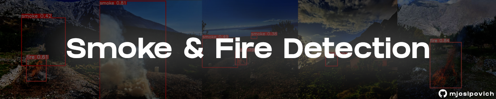

# Fire Detection in Mediterranean Olive Groves
Training YOLOv8 models for fire and smoke detection from scratch on the D-Fire dataset and custom data specific to Mediterranean olive groves. 
Deployment and testing of trained models using Streamlit.<br><br>


## Motivation
In recent years, Mediterranean countries have faced numerous wildfires, often caused by the mishandling of dry leaves and branches in olive groves.
These areas, usually remote from urban infrastructure, challenge the immediate detection of early-stage fires, delaying response times and reducing the likelihood of a positive outcome.
Object detection models trained on terrain-specific data, coupled with basic monitoring infrastructure, can significantly enhance early detection of fire and smoke, improving response effectiveness.

## Training
Models were trained based on YOLOv8n and YOLOv8s, with plans to train heavier models as well. Training utilized the D-Fire dataset for baseline performance and our Croatian Fire Dataset for terrain-specific nuances. 

### Training Structure
```yaml
data:
  - images:
      - train
      - test
  - labels:
      - train
      - test
```

### Training Results
Both models were trained for 150 epochs using CUDA on an Nvidia RTX 3070 Ti. The training process can be visualized through the following images, which display how each model's metrics evolved:
<div style="display: grid; grid-template-columns: 1fr 1fr; gap: 0;">
    
    
</div>

The training metrics show that both models improved significantly, reducing loss and increasing precision. The YOLOv8 small model displayed a slight advantage over the nano model in all evaluated metrics, suggesting that further training could yield even better results.

### Testing
Both models were tested on a subset of the Croatia_fire_dataset to evaluate their performance on terrain-specific challenges. The testing settings were as follows:

``` 
Settings
  - IOU: 0.4
  - Confidence Threshold: 0.3
```

### Good predictions
Both models have shown great preformance on most of the tested images including these...
<div style="display: grid; grid-template-columns: 1fr 1fr; gap: 0;">
    
    
While both models performed well, model based on YOLOv8s usually predicts with more precision and higher confidence levels.

### Mixed predictions
Some predictions which resulted in different outcomes between the models.
<div style="display: grid; grid-template-columns: 1fr 1fr; gap: 0;">
    
    
YOLOv8n based model fails to detect smoke objects in both images while the YOLOv8s does a good job detecting all objects.

## Deployment
To demonstrate the capabilities of the trained models, Streamlit was used to create a simple, practical, and aesthetically pleasing web application. 
<br>You can try it out here: [Fire and Smoke Detection App](https://fire-smoke-detection.streamlit.app/)

<div align="center">
  
  <p>Fire and Smoke Detection App</p>
</div>

## Datasets
### D-Fire Dataset
Both models are based on and trained using this dataset, which contains over 21,000 images featuring a variety of scenes across different landscapes.
<br> You can check it out here: [D-Fire Dataset](https://github.com/gaiasd/DFireDataset)
### CFD (Croatian Fire Dataset)
This dataset includes over 50 images of specific Mediterranean coastal landscapes with fires in olive groves, used additionally to test the models' capability to detect such fires.
<br> You can download it here: [Croatia Fire Dataset](https://github.com/mjospovich/Fire-Smoke-Detection/releases/tag/croatian_fire_dataset)

## Acknowledgments
I would like to thank the creators of the [D-Fire dataset](https://github.com/gaiasd/DFireDataset) for providing a valuable resource that formed the foundation of this project. 
Also, a big thank you to the team at [Ultralytics](https://github.com/ultralytics/ultralytics) for creating YOLOv8, which simplified achieving remarkable results in object detection. 
Lastly, a thumbs up to the team behind [Streamlit](https://github.com/streamlit/streamlit), which has made deploying these models incredibly straightforward and effective.

## Licence
This project is licensed under the [AGPL-3.0 License](https://www.gnu.org/licenses/agpl-3.0.html).

<sub><sup>
Made with 🔥 by Martin Josipović, 2024.
</sup></sub>
